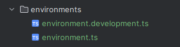

= Configuration for Keycloak (01.10.24)

== Frontend
* Found in:
** app.guard.ts in src/app/utils
** app.init.ts in src/app/utils
** environment.development.ts in src/environments (local development configuration)
** environment.ts in src/environments (production configuration)

image::images/folder.png[]

****
* app.init.ts
** Configurations made in this file:
*** url: The URL where the keycloak is found. *(https://auth.htl-leonding.ac.at)*
*** realm: The realm for our project, which is set in the keycloak. *(htl-leonding)*
*** clientId: The clientID is the "name" of our project in the realm 'htl-leonding' in the keycloak.
**** We have two configurations. One for the deployed application on the server, and one for local development.
***** leovote (deployed)
***** leovotetest (local development)
**** These are set in the environment files
*** initOptions: the checkLoginIframe option is a iframe that is used to detect if a Single-Sign Out has occurred.

[source, javascript]
----
export function initializeKeycloak(keycloak: KeycloakService): () => Promise<boolean> {
  return () =>
    keycloak.init({
      config: {
        url: 'https://auth.htl-leonding.ac.at',
        realm: 'htl-leonding',
        clientId: environment.clientId,
        //clientId: 'leovote' for production
        //clientId: 'leovotetest' for local development
      },
      initOptions: {
        checkLoginIframe: true,
        checkLoginIframeInterval: 20
      },
      loadUserProfileAtStartUp: true
    });
}
----

* environment.ts

[source, javascript]
----
export const environment = {
  production: true,
  apiUrl: 'http://leovote.htl-leonding.ac.at/api/',
  clientId: 'leovote'
};
----

* environment.development.ts

[source, javascript]
----
export const environment = {
  production: false,
  apiUrl: 'http://localhost:8080/',
  clientId: 'leovotetest'
};
----
****

****
* app.guard.ts
* Configurations:
** Set the keycloak login redirectURL.
*** This Setting forces the user to stay on login page, if currently unauthenticated.
** The roles, which are needed to successfully login are set.
*** This configuration loads the needed roles out of the route and checks if the user contains them. If so,
the user is allowed to proceed.

[source, javascript]
----
export class AuthGuard extends KeycloakAuthGuard {
  constructor(
    protected override readonly router: Router,
    protected readonly keycloak: KeycloakService
  ) {
    super(router, keycloak);
  }

  public async isAccessAllowed(
    route: ActivatedRouteSnapshot,
    state: RouterStateSnapshot
  ): Promise<boolean> {
    // Force the user to log in if currently unauthenticated.
    if (!this.authenticated) {
      await this.keycloak.login({
        redirectUri: window.location.origin + state.url
      });
    }

    // Get the roles required from the route.
    const requiredRoles = route.data["roles"];

    // Allow the user to proceed if no additional roles are required to access the route.
    if (!Array.isArray(requiredRoles) || requiredRoles.length === 0) {
      return true;
    }

    // Allow the user to proceed if all the required roles are present.
    return requiredRoles.every((role) => this.roles.includes(role));
  }
}
----
****

IMPORTANT:: There is no Client-Secret needed for the frontend configuration, since there is no safe way to save those.

== Backend
* WIP