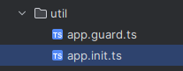
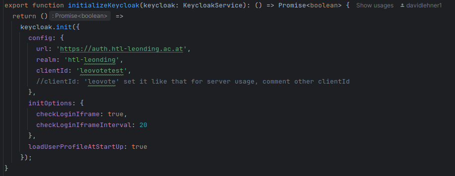
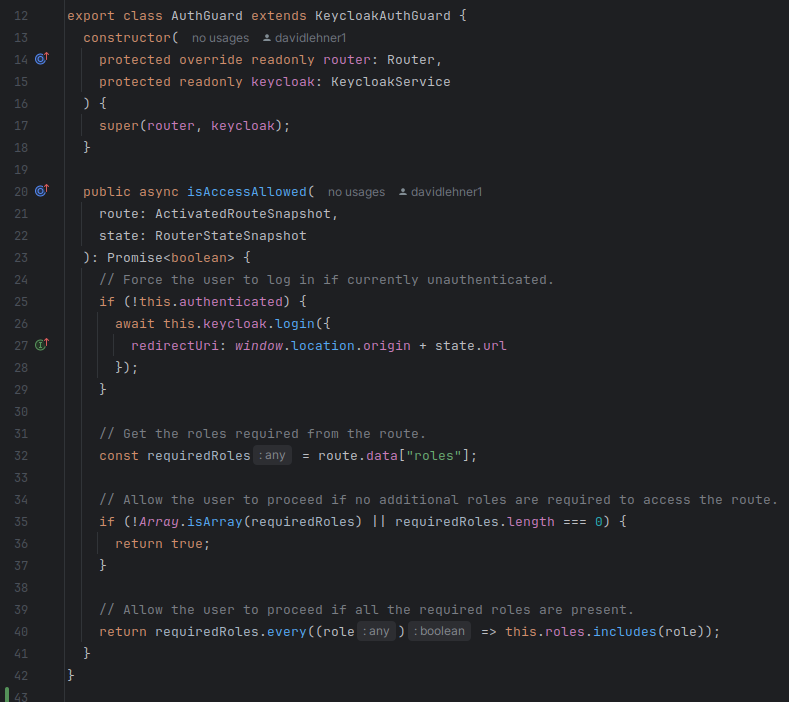

= Configuration for Keycloak (01.10.24)

== Frontend
* The whole configuration for out Keycloak is found in those two ts files found in out util directory.

****
* app.init.ts
** Configurations made in this file:
*** The URL where the keycloak is found.
*** The realm for our project, which is set in the keycloak.
*** The clientID, which is the "name" of our project in the keycloak.
**** We have two configurations. One for the deployed application on the server, and one for local testing.
*** We also set the iframe from the keycloak to be shown (the login mask)

****

****
* app.guard.ts
** Configurations made in this file:
*** Set the keycloak login redirectURL.
**** Where the browser has to go, to show the login mask
*** The roles, which are needed to successfully login are set.
**** This configuration however is blank. The roles are empty and not a single role is needed.

****

== Backend
* WIP