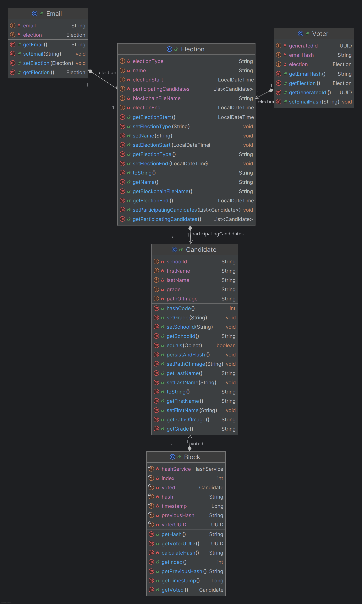

= LeoVote Backend Documentation
:toc:
:icons: font

This is the documentation for the backend of the LeoVote project.
The backend is written in Java and uses Quarkus as the framework.

== Prerequisites

Before starting, ensure you have the following installed:

* JDK 21
* Quarkus CLI (optional)

== Start the backend

To start the backend, run the following command in the root directory of the backend project:

If you have the Quarkus CLI installed:

[source,shell]
----
quarkus dev --clean
----

If you don't have the Quarkus CLI installed:

[source,shell]
----
./mvnw compile quarkus:dev
----

== Architecture

